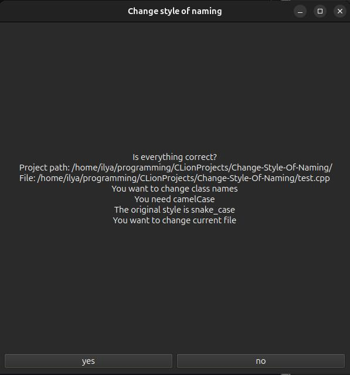

# Change style of naming
### This program changes style of naming variables, functions and classes(for example PascalCase -> snake_case, snake_case -> camelCalse etc.)
### Code style https://google.github.io/styleguide/cppguide.html
### At the moment parsing of variables is not implemented

### How to work:
 <ol>
        <li>Download project(git clone https://github.com/IlyaChvanov/change-style-of-naming.git) </li>
        <li>Run it</li>
        <li>Enter the directory path</li>
        <li>Enter the path of the file yuo want to change</li>
        <li>Enter what you whant to change</li>
        <li>Enter necessary style</li>
        <li>Enter the original style</li>
        <li>Enter if you want to change the existing file or create a new one</li>
        <li>Confirm your input</li>
 </ol>

### Examples
 .jpg)
----------------------------------------------------------------
 

